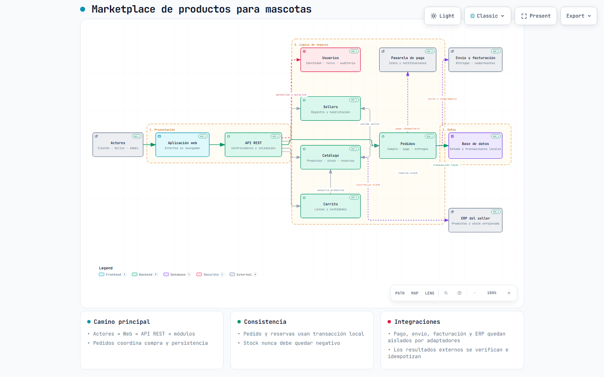
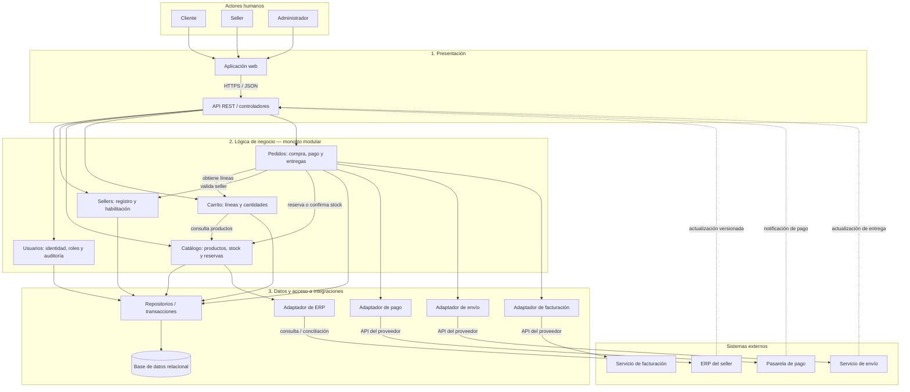

# Arquitectura inicial del sistema

## Propuesta y alcance

Se propone una arquitectura lógica de **tres capas**, implementable inicialmente como un **monolito modular**. Usuarios, Sellers, Catálogo, Carrito y Pedidos son módulos del mismo backend, no servicios desplegados de manera independiente. El diagrama representa responsabilidades y comunicaciones, no servidores ya instalados.

La base de datos relacional es una decisión propuesta. No se selecciona lenguaje, framework, motor ni proveedor. Las integraciones usan contratos y adaptadores para poder sustituirse por simuladores durante el desarrollo académico.

## Diagrama de arquitectura

### Vista gráfica para GitHub

La imagen anterior se muestra directamente en GitHub. La versión [interactiva de Archify](marketplace-arquitectura.html) debe descargarse y abrirse en un navegador, ya que GitHub muestra los archivos HTML como código fuente.

### Diagrama editable en Mermaid

Las flechas continuas muestran solicitudes; las discontinuas representan notificaciones entrantes. Las respuestas se omiten para mantener legibilidad. La API valida la autenticidad de las notificaciones mediante el adaptador correspondiente y delega su procesamiento a Pedidos o Catálogo.

Se amplía la capa de datos del esquema de la guía con repositorios y adaptadores de acceso externo. **La base de datos no llama a los proveedores.** Pedidos y Catálogo coordinan integraciones por medio de adaptadores. Los sistemas externos quedan fuera de las tres capas propias.

## Responsabilidades por capa

| Capa | Responsabilidad | Incluye | No le corresponde |
|---|---|---|---|
| Presentación | Recibir interacción humana y solicitudes externas; mostrar resultados. | Web, controladores REST, validación de formato, identidad y recepción de notificaciones. | Decidir importes definitivos, reservar stock o consultar tablas directamente. |
| Lógica de negocio | Ejecutar casos de uso y aplicar reglas y permisos sobre recursos. | Usuarios, Sellers, Catálogo, Carrito y Pedidos. | Conocer detalles HTTP de proveedores o generar pantallas. |
| Datos y acceso a integraciones | Persistir información y traducir contratos técnicos externos. | Repositorios, transacciones, base y adaptadores de pago, envío, facturación y ERP. | Decidir cuándo un pedido cumple condiciones para pagarse o enviarse. |

Dependencia permitida: **presentación → negocio → datos**. Los módulos de negocio se comunican mediante operaciones definidas y evitan modificar tablas ajenas directamente. Los adaptadores traducen formatos; las reglas permanecen en negocio. Una misma unidad de trabajo permite que Pedidos y Catálogo participen en la transacción local de creación y reserva.

## Módulos y trazabilidad funcional

| Módulo | Responsabilidades | Requisitos |
|---|---|---|
| Usuarios | Registro, autenticación, roles y consulta autorizada de auditoría. Cada módulo genera sus eventos críticos y verifica propiedad. | RF10, RF15 |
| Sellers | Registro, actualización y estado de habilitación del vendedor. | RF07 |
| Catálogo | Búsqueda, detalle, productos por seller, sincronización ERP, inventario y reservas. | RF01, RF02, RF03, RF14, RF16 |
| Carrito | Mantener líneas y cantidades del cliente y calcular un total preliminar. | RF04 |
| Pedidos | Crear y consultar pedidos; coordinar reserva, pago, preparación, entrega y comprobantes. | RF05, RF06, RF08, RF09, RF11, RF12, RF13, RF16 |

## Información persistida

| Grupo | Datos principales e invariantes |
|---|---|
| Usuarios y roles | Identidad, credencial protegida y permisos; un registro público no concede roles privilegiados. |
| Sellers | Perfil y estado; desactivar no elimina historial. |
| Productos e inventario | Seller, descripción, precio, fuente de stock, versión y reservas; disponibilidad no negativa. |
| Carritos y líneas | Cliente, producto y cantidad; agregar no reserva unidades. |
| Pedidos y líneas | Cliente, dirección, importes, moneda, precio histórico y seller de cada línea. |
| Pagos | Identificador del proveedor, pedido, intento, clave idempotente y estado; no datos completos de tarjeta. |
| Entregas y comprobantes | Referencias y estados separados, con entregas por seller y líneas asociadas. |
| Auditoría y tareas pendientes | Actor, acción, recurso, fecha, resultado y operaciones por reintentar; sin secretos. |

## Flujo de compra y manejo de fallos

1. El cliente consulta la web; la API delega la búsqueda a Catálogo, que obtiene productos mediante repositorios.
2. Carrito conserva las líneas. Antes de comprar, Pedidos solicita el carrito y revalida precios, sellers y dirección; no acepta como definitivo un total enviado por la web.
3. Pedidos y Catálogo crean el pedido y sus reservas en una transacción local. Una actualización condicionada impide reservar dos veces la última unidad. Si una línea falla, se revierte todo.
4. Después de confirmar la transacción, Pedidos solicita el pago mediante el adaptador con clave de idempotencia. La llamada remota no mantiene abierta la transacción local.
5. El proveedor notifica el resultado a la API. Tras validar autenticidad, importe y referencia, Pedidos registra el evento y cambia el estado una sola vez. Confirma stock y registra tareas posteriores en la misma transacción local.
6. Ante un timeout se consulta el pago antes de reintentar. Las reservas vencidas se liberan según la política acordada; un pago tardío pasa a revisión y no dispara el envío automáticamente.
7. Un procesador de tareas del mismo backend lee operaciones pendientes persistidas. Solicita facturación después del pago y envío después de que el seller registra preparación. Cada operación tiene una clave estable para evitar duplicados cuando el proveedor soporta idempotencia; en otro caso se concilia por referencia antes de reenviar.
8. Los fallos temporales se reintentan de forma limitada y con espera creciente. Los fallos persistentes quedan pendientes de atención, preservando pedido y pago.
9. El cliente consulta sus estados. Las entregas se gestionan por seller y el pedido se considera entregado cuando todas las entregas requeridas están completas.

**Estados propuestos:** pago `pendiente`, `aprobado`, `rechazado` o `en_revision`; reserva `activa`, `consumida` o `liberada`; entrega `pendiente`, `en_preparacion`, `despachada` o `entregada`; comprobante `pendiente` o `emitido`. Pago y entrega no comparten un único estado.

## Decisiones ligadas a los drivers

| Decisión | Drivers atendidos | Justificación |
|---|---|---|
| Monolito modular y tres capas | DA06 | Reduce complejidad inicial y delimita responsabilidades. |
| API REST con validación y autorización por recurso | DA03, DA05 | Cumple la comunicación requerida y protege datos de cada actor. |
| Consultas paginadas, índices y estado persistente | DA01, DA02 | Permite medir rendimiento y evaluar varias instancias. |
| Repositorios y transacciones locales | DA07 | Mantiene pedido y reservas consistentes dentro del sistema. |
| Adaptadores y resultados de pago verificables | DA04, DA06 | Aísla proveedores y evita confiar en la respuesta del navegador. |
| Tareas persistentes, conciliación y estados independientes | DA04, DA08 | Permite recuperarse de fallos externos sin perder compras. |

## Límites y próximas validaciones

- Confirmar duración de reservas, cancelaciones, reembolsos, costo de envío y responsabilidad de emitir comprobantes.
- Definir conciliación con ERP y otros canales; una transacción local no garantiza stock global.
- Acordar contratos, firmas, idempotencia y límites de proveedores. Las notificaciones dibujadas son una posibilidad propuesta.
- Implementar pruebas de permisos, concurrencia, repetición de eventos y recuperación antes de afirmar que se cumplen las metas.
- Evaluar carga y disponibilidad de base y backend. Tres capas lógicas no implican tres servidores ni alta disponibilidad automática.

Esta entrega cubre el diseño inicial de los ejercicios 09 y 10. Los mecanismos de recuperación son decisiones documentadas, todavía no funcionalidad implementada.
