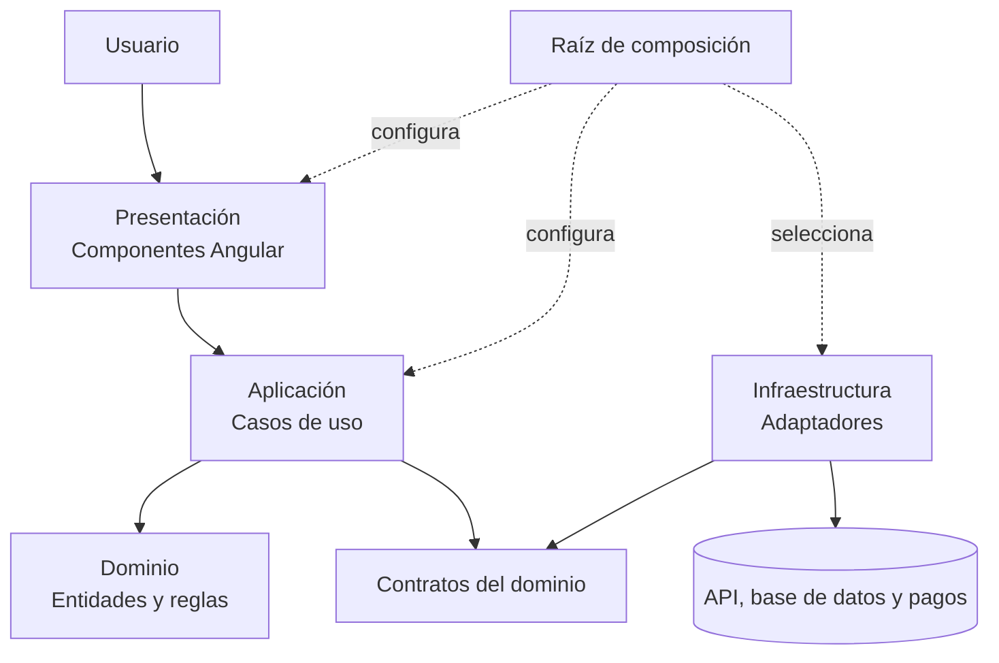
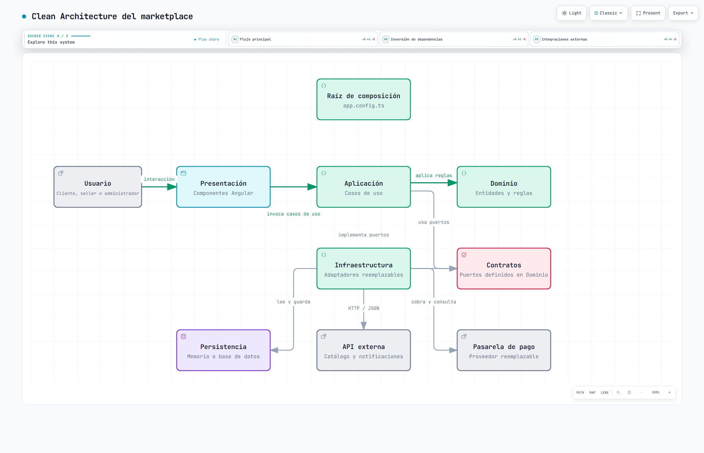

# Enfoque arquitectónico: Clean Architecture

## Definición solicitada

| Elemento | Definición para el marketplace |
|---|---|
| **Patrón arquitectónico** | Clean Architecture. |
| **Objetivo** | Separar responsabilidades y controlar las dependencias para que apunten hacia el Dominio. |
| **Problema que resuelve** | Evitar el acoplamiento entre la interfaz Angular, las reglas de negocio, la base de datos, las APIs y el servicio de pagos. |
| **Capas** | Presentación, Aplicación, Dominio e Infraestructura. |
| **Beneficios** | Facilita mantenimiento y pruebas, permite cambiar implementaciones sin cambiar el negocio y mejora la organización y separación de responsabilidades. |

## Regla de dependencia

El Dominio ocupa el centro y no conoce Angular, HTTP, bases de datos ni proveedores. Aplicación depende de modelos y contratos del Dominio. Presentación invoca casos de uso. Infraestructura implementa los contratos internos y traduce tecnologías externas. La raíz de composición conecta implementaciones con casos de uso al iniciar la aplicación.

### Vista gráfica para GitHub

La [versión interactiva de Archify](clean-architecture-marketplace.html) permite recorrer el flujo principal, la inversión de dependencias y las integraciones externas. GitHub muestra directamente la imagen anterior; para explorar el HTML debe descargarse y abrirse en un navegador.

## Correspondencia con el boilerplate analizado

| Capa | Elementos observados | Dependencias permitidas |
|---|---|---|
| Presentación | `catalogo.component.ts`, `carrito.component.ts`, `estado-carrito.servicio.ts` | Aplicación y tipos del Dominio necesarios para mostrar el estado. |
| Aplicación | `ConsultarCatalogoCasoUso`, `AgregarAlCarritoCasoUso`, `RegistrarCompraCasoUso` | Dominio y sus contratos. |
| Dominio | `Producto`, `Carrito`, `Pedido`, reglas de precios y contratos de repositorios, pagos y notificación | Únicamente código del propio Dominio. |
| Infraestructura | Repositorios en memoria/HTTP, pago simulado/Niubiz, notificación por consola/WhatsApp y tokens | Contratos del Dominio y bibliotecas externas requeridas por cada adaptador. |
| Composición | `app.config.ts` | Todas las capas para construir el grafo de objetos, sin contener reglas de negocio. |

## Ejemplo de sustitución

`RegistrarCompraCasoUso` recibe un `ProcesadorPagos`. Durante pruebas puede configurarse `ProcesadorPagosSimulado`; en un entorno integrado puede usarse `ProcesadorPagosNiubiz`. Ambos cumplen el mismo contrato. El caso de uso y las entidades no cambian cuando se sustituye el proveedor.

El mismo mecanismo permite cambiar `RepositorioProductosMemoria` por `RepositorioProductosHttp` o `NotificadorConsola` por `NotificadorWhatsApp`. Esta sustitución se concentra en la raíz de composición.

## Criterios de cumplimiento

- Dominio no importa Angular, HTTP ni clases de Infraestructura.
- Aplicación no instancia adaptadores concretos.
- Infraestructura implementa contratos definidos hacia el interior.
- Presentación delega las reglas y la coordinación a entidades y casos de uso.
- Las pruebas de Dominio y Aplicación pueden ejecutarse sin navegador.
- Cambiar un proveedor requiere configurar o crear un adaptador, no modificar reglas de negocio.

La [auditoría del boilerplate](../auditoria-boilerplate.md) registra las pruebas y la compilación ejecutadas para comprobar este enfoque.
