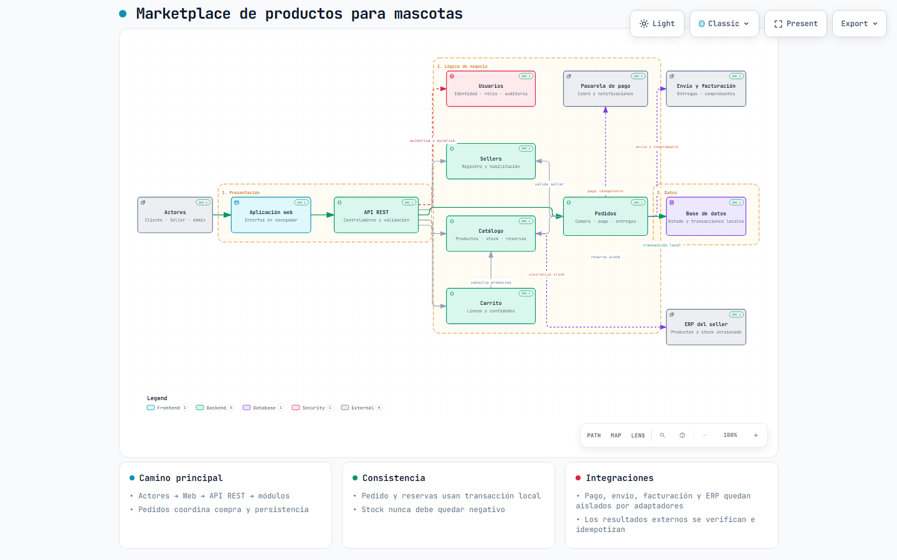
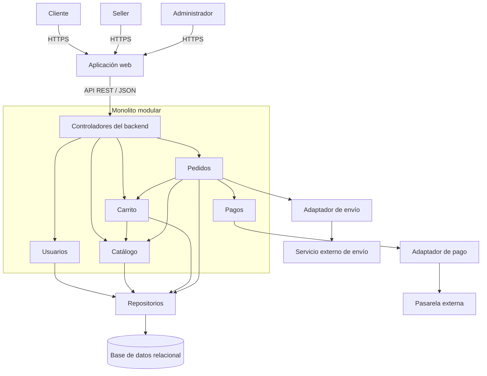

# Estilo arquitectónico del marketplace

## Estilo seleccionado

Se adopta un sistema **cliente-servidor** con un backend desplegado como **monolito modular** y organizado lógicamente en capas. La aplicación web consume una API REST; el backend contiene módulos de negocio y se conecta con persistencia y servicios externos mediante repositorios y adaptadores.

El monolito modular define la unidad de despliegue y los límites internos. Las capas definen las responsabilidades y la dirección de las dependencias. Esta combinación responde a DA01 y DA06 sin introducir al inicio la complejidad operativa de varios servicios desplegables.

## Componentes y relaciones

### Vista gráfica para GitHub

La versión [interactiva de Archify](marketplace-arquitectura.html) se descarga y se abre en un navegador. GitHub muestra los archivos HTML como código fuente.

### Diagrama editable

## Responsabilidades

| Elemento | Responsabilidad |
|---|---|
| Aplicación web | Capturar acciones y mostrar resultados; no decide reglas de negocio. |
| API REST | Autenticar, validar el formato de la solicitud e invocar casos de uso. |
| Módulos | Aplicar reglas y coordinar operaciones dentro de límites funcionales. |
| Repositorios | Abstraer persistencia y proteger al negocio de detalles del motor. |
| Adaptadores | Traducir contratos propios a protocolos y formatos de proveedores. |
| Base de datos | Conservar el estado transaccional del marketplace. |

## Relación con los drivers

| Driver | Respuesta del estilo |
|---|---|
| DA01 - Escalabilidad | El backend evita estado de sesión en memoria como requisito de afinidad y puede replicarse horizontalmente; la base y la caché se dimensionan con métricas. |
| DA03 - Seguridad | La API centraliza autenticación, autorización por recurso y validación de notificaciones externas. |
| DA04 - Pago externo | Pagos se comunica con la pasarela mediante un adaptador reemplazable. |
| DA05 - API REST | La interfaz web y el backend se comunican mediante recursos y operaciones REST. |
| DA06 - Mantenibilidad | Los módulos y capas delimitan cambios y evitan dependencias accidentales. |

## Alternativas evaluadas

| Alternativa | Evaluación |
|---|---|
| Monolito sin módulos | Menor estructura inicial, pero aumenta el acoplamiento y contradice DA06. |
| Microservicios desde el inicio | Permiten escalamiento independiente, pero exigen red, observabilidad, despliegues y consistencia distribuida sin evidencia de que el alcance lo requiera. |
| Monolito modular | Mantiene una operación simple y deja límites explícitos para evolucionar con evidencia. |

El estilo se complementa con el [enfoque Clean Architecture](enfoque/enfoque-arquitectonico.md), que define cómo se organiza el código dentro de cada módulo y hacia dónde pueden apuntar sus dependencias.
